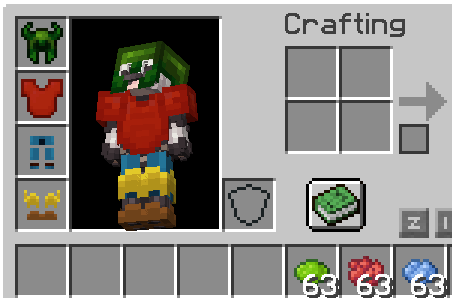
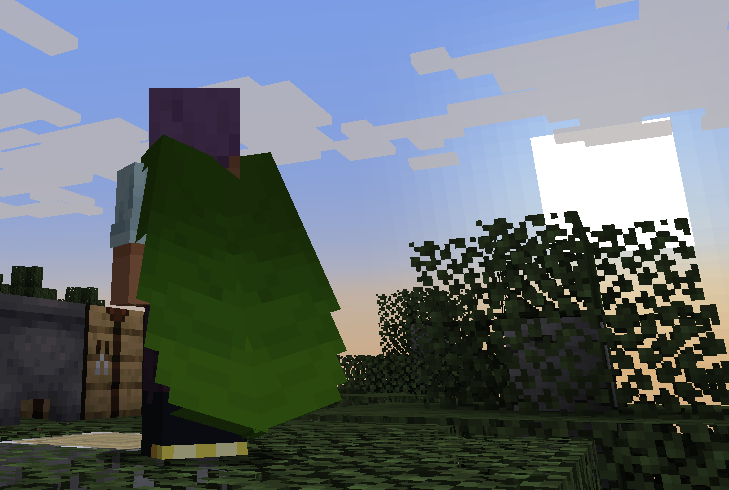
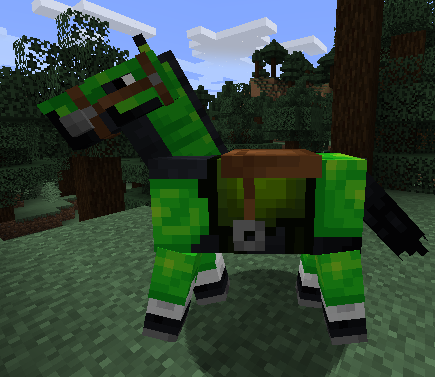
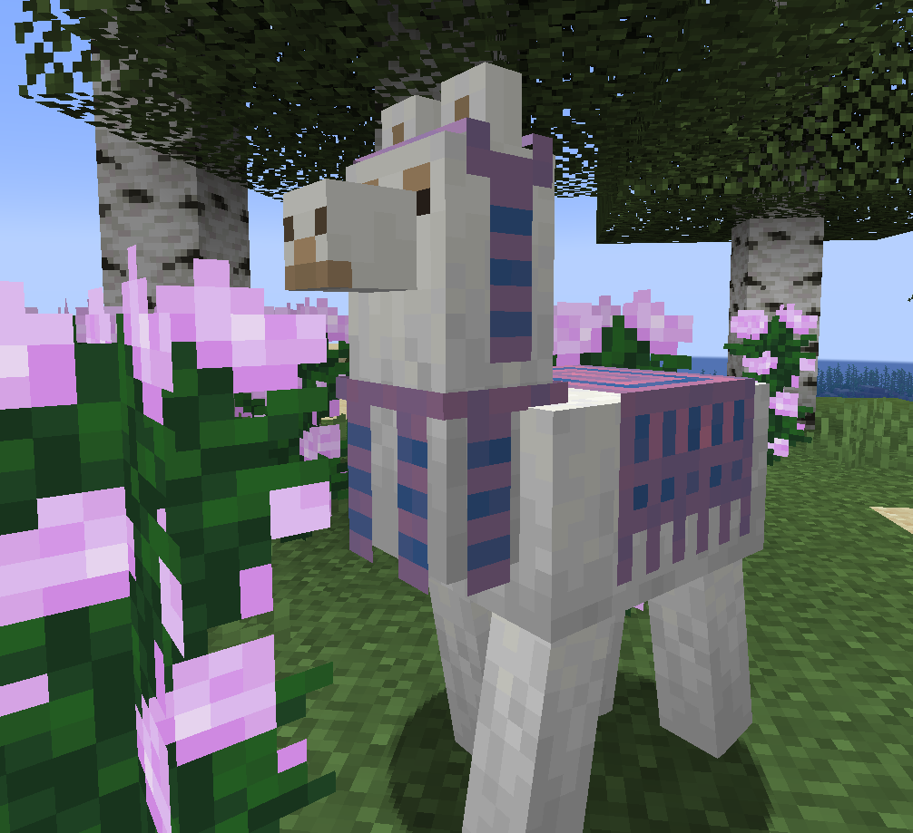
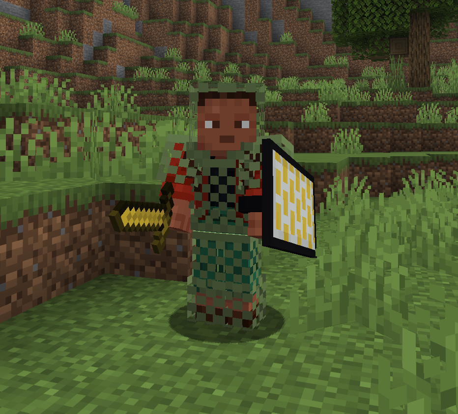
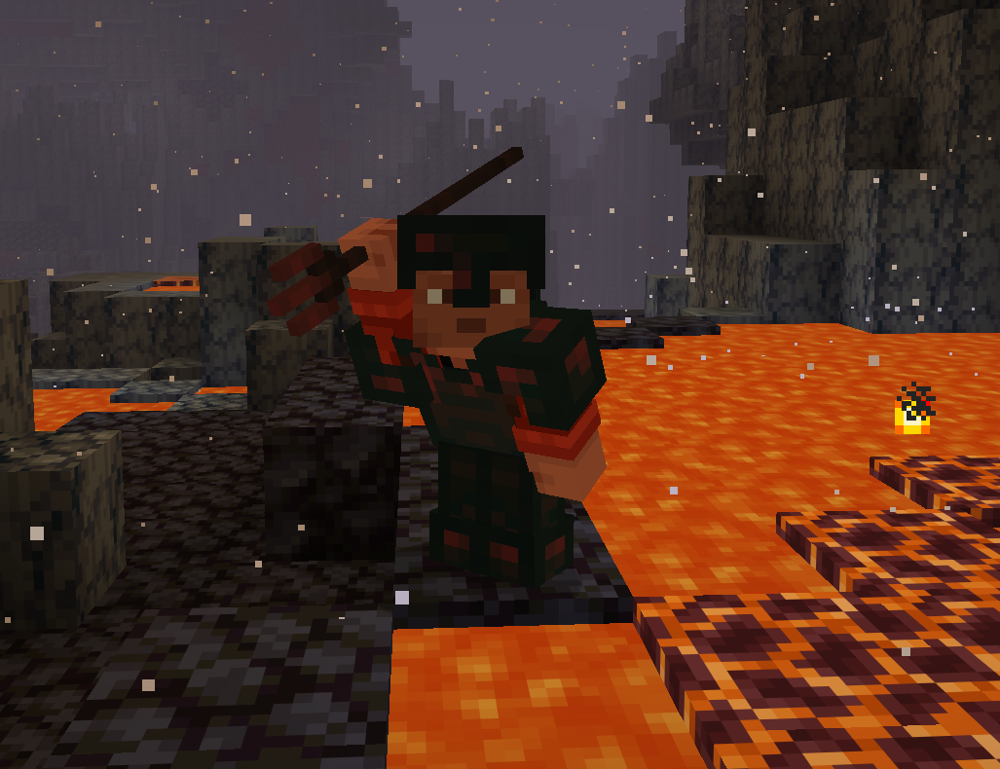

### Dye All The Things

###### This was a terrible idea.

A Fabric Minecraft mod that lets you dye **all items** exactly like leather armor! \*

###### \* May or may not work in some cases.

Things that are known to work are:

- all armor including Elytra, Horse armor, Nautilus armor - even Llama carpets
- all tools and weapons, including Tridents and Shields
- most modded items (generally, if they use special rendering, they need to be explicitly supported)

Things that will not work:

- blocks and most 3D looking items

#### Feature History:

- 1.9.0 for 26.1: All items can be dyed
- 1.7.0 for 1.21.5: All armor + Elytra can be dyed
- before 1.7.0: All armor can be dyed

---

- for Minecraft 1.16 and up
- required on server and client

